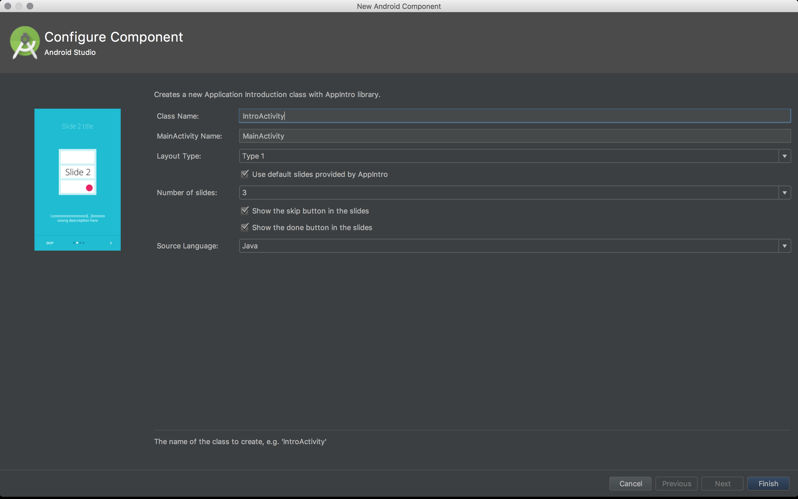

# Android Studio Templates



The template implements the [AppIntro library activity][1].  
The template is used to:
- create the class of the Intro Activity
- create the class of the Main Activity
- add the 2 class in the Android Manifest
- add launcher for the Main Activity in the Android Manifest
- create an array of Strings for the titles of the slides (arrays.xml)
- create an array of Strings for the descriptions of the slides (array.xml)


## Install

To install a template in your installation of Android Studio, download
the zip file corresponding to your Android Studio version. If doubt, download Android Studio 2.
- Android Studio 2: AppIntroTemplate2.zip
- Android Studio 3:  AppIntroTemplate3.zip

Extract the 
zip and copy the folder in the following directory.

```
AndroidStudioInstallationFolder/plugins/android/lib/templates/other/
```
Example for Windows:
```
C:/Program Files/Android/Android Studio/plugins/android/lib/templates/other/
```


## How to start a project with the template?

After you copy the template files in the template folder of the Android Studio Application, restart Android Studio.
You can create a project using AppIntro quickly with the template provided.  

Create a new project with no activity.  
In the main folder, right click -> new -> App Intro -> App Intro  
You will see the template window, you can enter the name of the Intro Activity and the name of the Main Activity.  
Those activities should not already exist. You have the choice between the type of slides that you want,the number of slides, etc...  

Notes: The templates are available in both Java and Kotlin. Make sure to use the correct template based on the version of your Android Studio. If you are using Android Studio 3.0 Canary, use the Android Studio 3 template files.

[1]: https://github.com/apl-devs/AppIntro

